# System Architecture

Comprehensive technical documentation of the AI-Powered Job Search System architecture, design patterns, and implementation details.

## Overview

The AI-Powered Job Search System is built using a multi-agent architecture pattern implemented with the CrewAI framework. The system orchestrates five specialized AI agents that work together to discover, evaluate, and recommend job opportunities based on user profiles.

## High-Level Architecture

```mermaid
graph TB
    subgraph "🎯 User Interface"
        CLI[Command Line Interface]
        Profile[User Profile JSON]
    end

    subgraph "🤖 CrewAI Framework"
        Crew[JobSeeker Crew]

        subgraph "AI Agents"
            JobSearch[🔍 Job Search Agent]
            JobEval[⚖️ Job Evaluator Agent]
            Database[🗄️ Database Manager Agent]
            ReportGen[📄 Report Generator Agent]
            AppCoord[🎯 Application Coordinator Agent]
        end

        subgraph "Tasks"
            SearchTask[job_search_task]
            EvalTask[job_evaluation_task]
            DBTask[database_storage_task]
            ReportTask[report_generation_task]
            AppTask[application_coordination_task]
        end
    end

    subgraph "🛠️ Tools & External Services"
        SerperTool[SerperDevTool]
        SerperAPI[Serper API]
        JobSearchTool[job_search_tool]
        EvalTool[job_evaluation_tool]
        DBTool[database_tool]
        ReportTool[report_generation_tool]
    end

    subgraph "💾 Data Storage"
        SQLite[(SQLite Database)]
        JobDB[job_opportunities.db]
    end

    subgraph "📄 Output Files"
        JobReport[job_search_report.md]
        AppStrategy[application_strategy.md]
    end
```



## Core Components

### 1. CrewAI Framework Integration

#### JobSeeker Crew Class
**File**: `src/job_seeker/crew.py`

The main orchestrator that manages all agents and tasks:

```python
class JobSeeker:
    def __init__(self):
        self.agents_config = 'config/agents.yaml'
        self.tasks_config = 'config/tasks.yaml'

    def crew(self) -> Crew:
        return Crew(
            agents=self.agents,
            tasks=self.tasks,
            process=Process.sequential,
            verbose=True
        )
```

**Responsibilities:**
- Agent lifecycle management
- Task execution coordination
- Configuration loading and validation
- Error handling and recovery
- Context passing between agents

#### Agent Configuration
**File**: `src/job_seeker/config/agents.yaml`

Defines agent personalities, roles, and capabilities:

```yaml
job_search_agent:
  role: >
    Senior Job Search Specialist
  goal: >
    Find the most relevant job opportunities across multiple platforms
  backstory: >
    You are an expert recruiter with deep knowledge of job markets...
  tools:
    - job_search_tool
  memory: true
  verbose: true
```

#### Task Configuration
**File**: `src/job_seeker/config/tasks.yaml`

Specifies task definitions and execution parameters:

```yaml
job_search_task:
  description: >
    Search for job opportunities across multiple platforms...
  expected_output: >
    A comprehensive list of job opportunities in JSON format...
  agent: job_search_agent
  tools:
    - job_search_tool
```

### 2. Multi-Agent Architecture

#### Agent Specialization

Each agent has a specific domain of expertise:

**Job Search Agent**
- **Purpose**: Job discovery and data collection
- **Tools**: SerperDevTool, web scraping utilities
- **Output**: Structured job opportunity data
- **Capabilities**:
  - Multi-platform job searching
  - Data normalization and cleaning
  - Rate limiting and API management
  - Fallback to mock data when needed

**Job Evaluator Agent**
- **Purpose**: Intelligent job opportunity assessment
- **Tools**: Custom evaluation algorithms, NLP processing
- **Output**: Scored jobs with reasoning
- **Capabilities**:
  - Skills matching using semantic analysis
  - Experience level compatibility assessment
  - Location preference evaluation
  - Salary expectation alignment
  - Company culture fit analysis

**Database Manager Agent**
- **Purpose**: Data persistence and management
- **Tools**: SQLite operations, data validation
- **Output**: Stored opportunities with metadata
- **Capabilities**:
  - Database schema management
  - Data integrity validation
  - Duplicate detection and handling
  - Search history tracking
  - Performance optimization

**Report Generator Agent**
- **Purpose**: Analysis and report creation
- **Tools**: Markdown generation, statistical analysis
- **Output**: Comprehensive job search reports
- **Capabilities**:
  - Top opportunities ranking
  - Market analysis and insights
  - Skills gap identification
  - Visual data representation
  - Trend analysis

**Application Coordinator Agent**
- **Purpose**: Strategic application guidance
- **Tools**: Strategy algorithms, template generation
- **Output**: Personalized application strategies
- **Capabilities**:
  - Cover letter template generation
  - Interview preparation guidance
  - Application timeline planning
  - Company research insights
  - Networking recommendations

#### Agent Communication Pattern

```mermaid
sequenceDiagram
    participant User as 👤 User
    participant Crew as 🤖 CrewAI Crew
    participant JS as 🔍 Job Search Agent
    participant JE as ⚖️ Job Evaluator Agent
    participant DB as 🗄️ Database Manager Agent
    participant RG as 📄 Report Generator Agent
    participant AC as 🎯 Application Coordinator Agent

    User->>Crew: Execute job search
    Crew->>JS: job_search_task
    JS-->>Crew: Job opportunities (JSON)

    Crew->>JE: job_evaluation_task
    JE-->>Crew: Scored opportunities

    Crew->>DB: database_storage_task
    DB-->>Crew: Storage confirmation

    Crew->>RG: report_generation_task
    RG-->>Crew: Analysis report

    Crew->>AC: application_coordination_task
    AC-->>Crew: Application strategy

    Crew-->>User: Complete results
```



### 3. Custom Tools Architecture

#### Tool Base Class
**File**: `src/job_seeker/tools/job_search_tools.py`

All custom tools inherit from CrewAI's BaseTool:

```python
from crewai_tools import BaseTool
from typing import Type, Any
from pydantic import BaseModel, Field

class JobSearchTool(BaseTool):
    name: str = "job_search_tool"
    description: str = "Search for job opportunities across multiple platforms"

    def _run(self, query: str, job_sites: list = None) -> str:
        # Implementation details
        return json.dumps(results)
```

#### Job Search Tool

**Capabilities:**
- Multi-platform job searching via SerperDev API
- Intelligent query construction
- Rate limiting and error handling
- Data normalization across sources
- Fallback mechanisms for API failures

**Implementation Details:**
```python
def _search_site(self, query: str, site: str, max_results: int):
    """Search specific job site with retry logic"""
    try:
        # Primary: SerperDev API
        response = self._serper_search(query, site)
        return self._parse_serper_response(response)
    except Exception as e:
        # Fallback: Mock data
        return self._generate_mock_jobs(query, max_results)
```

#### Job Evaluation Tool

**Scoring Algorithm:**
- Skills Match (40%): Semantic similarity between user skills and job requirements
- Experience Level (25%): Compatibility with required experience
- Location Preference (15%): Geographic and remote work alignment
- Salary Expectations (10%): Compensation range matching
- Company Culture (10%): Company type and culture fit

**Implementation:**
```python
def _calculate_match_score(self, job: Dict, profile: Dict) -> float:
    """Calculate 0-100 match score with detailed reasoning"""
    scores = {
        'skills': self._score_skills_match(job, profile),
        'experience': self._score_experience_match(job, profile),
        'location': self._score_location_match(job, profile),
        'salary': self._score_salary_match(job, profile),
        'company': self._score_company_match(job, profile)
    }

    weights = {
        'skills': 0.40,
        'experience': 0.25,
        'location': 0.15,
        'salary': 0.10,
        'company': 0.10
    }

    return sum(scores[k] * weights[k] for k in scores)
```

#### Database Tool

**Schema Design:**
```sql
CREATE TABLE job_opportunities (
    id INTEGER PRIMARY KEY AUTOINCREMENT,
    title TEXT NOT NULL,
    company TEXT NOT NULL,
    location TEXT,
    description TEXT,
    requirements TEXT,
    salary_range TEXT,
    url TEXT UNIQUE,
    source TEXT,
    discovered_date TIMESTAMP DEFAULT CURRENT_TIMESTAMP,
    match_score REAL,
    evaluation_notes TEXT,
    application_status TEXT DEFAULT 'not_applied'
);

CREATE TABLE search_history (
    id INTEGER PRIMARY KEY AUTOINCREMENT,
    search_date TIMESTAMP DEFAULT CURRENT_TIMESTAMP,
    search_criteria TEXT,
    results_count INTEGER,
    execution_time REAL,
    api_calls_made INTEGER
);
```

**Operations:**
- CRUD operations with validation
- Duplicate detection and handling
- Search history tracking
- Performance optimization with indexes
- Data integrity constraints

#### Report Generation Tool

**Report Structure:**
1. **Executive Summary**: Key findings and statistics
2. **Top Opportunities**: Ranked list with scores
3. **Match Analysis**: Detailed scoring breakdown
4. **Skills Gap Analysis**: Missing skills identification
5. **Market Insights**: Salary trends and demand
6. **Company Analysis**: Target company information
7. **Recommendations**: Next steps and actions

**Template System:**
```python
class ReportGenerator:
    def generate_report(self, jobs: List[Dict], profile: Dict) -> str:
        template = self._load_template('job_search_report.md.j2')
        context = {
            'profile': profile,
            'top_jobs': self._rank_opportunities(jobs),
            'market_analysis': self._analyze_market(jobs),
            'skills_gap': self._identify_skills_gap(jobs, profile),
            'statistics': self._calculate_statistics(jobs)
        }
        return template.render(context)
```

### 4. Data Architecture

#### Data Flow


#### Data Models

**User Profile Model:**
```python
from pydantic import BaseModel, Field
from typing import List, Optional

class UserProfile(BaseModel):
    name: str
    email: str
    current_role: str
    years_experience: int
    location: str
    preferred_locations: List[str]
    expected_salary: int
    skills: List[str]
    education: Optional[List[Education]] = []
    experience: Optional[List[Experience]] = []
    certifications: Optional[List[str]] = []
```

**Job Opportunity Model:**
```python
class JobOpportunity(BaseModel):
    title: str
    company: str
    location: Optional[str]
    description: str
    requirements: List[str]
    salary_range: Optional[str]
    url: str
    source: str
    discovered_date: datetime
    match_score: Optional[float]
    evaluation_notes: Optional[str]
```

#### Storage Strategy

**Local Storage Benefits:**
- Privacy: No data leaves user's machine
- Performance: Fast local access
- Reliability: No network dependencies for stored data
- Cost: No cloud storage fees

**SQLite Database Design:**
- Lightweight and embedded
- ACID compliance for data integrity
- Full-text search capabilities
- JSON column support for flexible data
- Efficient indexing for quick queries

### 5. API and External Integrations

#### SerperDev API Integration

**Authentication:**
```python
headers = {
    'X-API-KEY': os.getenv('SERPER_API_KEY'),
    'Content-Type': 'application/json'
}
```

**Query Construction:**
```python
def _build_search_query(self, profile: Dict, job_sites: List[str]) -> str:
    """Build optimized search query for job platforms"""
    base_query = f"{profile['current_role']} {profile['location']}"

    # Add key skills for better targeting
    key_skills = profile['skills'][:3]  # Top 3 skills
    skills_query = " ".join(key_skills)

    # Site-specific query optimization
    if 'linkedin.com' in job_sites:
        return f"site:linkedin.com/jobs {base_query} {skills_query}"

    return f"{base_query} {skills_query} jobs"
```

**Rate Limiting:**
```python
class RateLimiter:
    def __init__(self, calls_per_minute: int = 60):
        self.calls_per_minute = calls_per_minute
        self.calls = []

    def wait_if_needed(self):
        now = time.time()
        # Remove calls older than 1 minute
        self.calls = [call for call in self.calls if now - call < 60]

        if len(self.calls) >= self.calls_per_minute:
            sleep_time = 60 - (now - self.calls[0])
            time.sleep(sleep_time)

        self.calls.append(now)
```

#### OpenAI API Integration

**Agent Configuration:**
```python
from crewai import Agent
from langchain_openai import ChatOpenAI

llm = ChatOpenAI(
    model_name=os.getenv('MODEL', 'gpt-4o'),
    temperature=0.1,
    max_tokens=2000
)

agent = Agent(
    role="Job Search Specialist",
    goal="Find relevant job opportunities",
    backstory="Expert recruiter...",
    llm=llm
)
```

### 6. Performance and Scalability

#### Performance Characteristics

**Execution Times:**
- Basic job search: 2-5 minutes
- Custom search: 1-3 minutes
- Database operations: < 1 second
- Report generation: 30-60 seconds

**Resource Usage:**
- Memory: 200-500 MB during execution
- Disk: 1-10 MB per search (database)
- Network: 1-5 MB per search
- API calls: 5-20 per search

#### Scalability Considerations

**Horizontal Scaling:**
- Multiple user profiles support
- Parallel search execution
- Distributed agent deployment (future)

**Vertical Scaling:**
- Memory-efficient data structures
- Streaming for large datasets
- Database optimization
- Caching strategies

#### Optimization Strategies

**Database Optimization:**
```sql
-- Indexes for common queries
CREATE INDEX idx_jobs_match_score ON job_opportunities(match_score DESC);
CREATE INDEX idx_jobs_company ON job_opportunities(company);
CREATE INDEX idx_jobs_location ON job_opportunities(location);
CREATE INDEX idx_search_date ON search_history(search_date DESC);
```

**Caching:**
```python
from functools import lru_cache

@lru_cache(maxsize=100)
def get_company_info(company_name: str) -> Dict:
    """Cache company information lookups"""
    return self._fetch_company_data(company_name)
```

**Memory Management:**
```python
def process_large_dataset(jobs: Iterator[Dict]) -> Iterator[Dict]:
    """Process jobs in batches to manage memory"""
    batch_size = 100
    batch = []

    for job in jobs:
        batch.append(job)
        if len(batch) >= batch_size:
            yield from self._process_batch(batch)
            batch = []

    if batch:
        yield from self._process_batch(batch)
```

### 7. Security and Privacy

#### Data Security

**Local Data Storage:**
- All personal data remains on user's machine
- No cloud storage or external data transmission
- SQLite database with file-level encryption option

**API Key Management:**
```python
def load_api_keys():
    """Secure API key loading with validation"""
    load_dotenv()

    serper_key = os.getenv('SERPER_API_KEY')
    if not serper_key:
        raise ValueError("SERPER_API_KEY is required")

    return {
        'serper': serper_key,
        'openai': os.getenv('OPENAI_API_KEY')  # Optional
    }
```

**Input Validation:**
```python
def validate_profile(profile: Dict) -> Dict:
    """Validate and sanitize user profile data"""
    schema = UserProfileSchema()
    try:
        validated = schema.load(profile)
        return schema.dump(validated)
    except ValidationError as e:
        raise ValueError(f"Profile validation failed: {e.messages}")
```

#### Privacy Protection

**Data Minimization:**
- Only collect necessary profile information
- No tracking or analytics by default
- User controls all data retention

**Anonymization:**
```python
def anonymize_for_logs(profile: Dict) -> Dict:
    """Remove PII from profile for logging"""
    safe_profile = profile.copy()
    safe_profile.pop('name', None)
    safe_profile.pop('email', None)
    safe_profile.pop('phone', None)
    return safe_profile
```

### 8. Error Handling and Recovery

#### Hierarchical Error Handling

**Application Level:**
```python
class JobSearchError(Exception):
    """Base exception for job search operations"""
    pass

class APIError(JobSearchError):
    """API-related errors with retry logic"""
    pass

class ValidationError(JobSearchError):
    """Data validation errors"""
    pass
```

**Agent Level:**
```python
def execute_with_retry(self, task_func, max_retries=3):
    """Execute task with exponential backoff retry"""
    for attempt in range(max_retries):
        try:
            return task_func()
        except RetryableError as e:
            if attempt == max_retries - 1:
                raise
            sleep_time = 2 ** attempt
            time.sleep(sleep_time)
```

**Tool Level:**
```python
def _run_with_fallback(self, primary_func, fallback_func, *args, **kwargs):
    """Execute primary function with fallback on failure"""
    try:
        return primary_func(*args, **kwargs)
    except Exception as e:
        logger.warning(f"Primary function failed: {e}, using fallback")
        return fallback_func(*args, **kwargs)
```

#### Recovery Mechanisms

**Database Recovery:**
```python
def ensure_database_integrity(self):
    """Check and repair database if needed"""
    try:
        self._test_database_operations()
    except sqlite3.DatabaseError:
        logger.warning("Database corruption detected, recreating")
        self._recreate_database()
```

**State Recovery:**
```python
def save_checkpoint(self, state: Dict):
    """Save execution state for recovery"""
    checkpoint_file = f"checkpoint_{int(time.time())}.json"
    with open(checkpoint_file, 'w') as f:
        json.dump(state, f)

def load_latest_checkpoint(self) -> Optional[Dict]:
    """Load most recent checkpoint for recovery"""
    checkpoints = glob.glob("checkpoint_*.json")
    if not checkpoints:
        return None

    latest = max(checkpoints, key=os.path.getctime)
    with open(latest, 'r') as f:
        return json.load(f)
```

## Architecture Benefits

### Modularity
- Each agent can be developed and tested independently
- Easy to add new job sources or evaluation criteria
- Clear separation of concerns

### Scalability
- Agents can be distributed across multiple processes
- Database can be scaled with partitioning
- Caching layers can be added transparently

### Reliability
- Fallback mechanisms for each component
- Graceful degradation under failure conditions
- Comprehensive error handling and recovery

### Maintainability
- Clear interfaces between components
- Extensive logging and monitoring
- Configuration-driven behavior

### Extensibility
- Plugin architecture for new tools
- Configurable agent behaviors
- Template-based report generation

## Future Architecture Enhancements

### Planned Improvements

1. **Microservices Architecture**: Split into independent services
2. **Event-Driven Processing**: Async task processing with queues
3. **REST API Layer**: Enable external integrations
4. **Real-time Updates**: WebSocket connections for live updates
5. **Machine Learning Pipeline**: Enhanced matching algorithms
6. **Distributed Caching**: Redis for improved performance
7. **Container Deployment**: Docker and Kubernetes support

### Technology Evolution

1. **LangChain Integration**: Enhanced LLM capabilities
2. **Vector Databases**: Semantic search improvements
3. **Graph Databases**: Relationship mapping
4. **Stream Processing**: Real-time data pipelines
5. **Edge Computing**: Local AI model deployment

For implementation details and development guidelines, see:
- [Development Guide](development.md)
- [API Reference](api-reference.md)
- [Performance Tuning](performance.md)