# CrewAI Job Seeker Architecture Diagram

```mermaid
graph TB
    subgraph "🎯 User Interface"
        CLI[Command Line Interface]
        Profile[User Profile JSON]
    end
    
    subgraph "🤖 CrewAI Framework"
        Crew[JobSeeker Crew]
        
        subgraph "AI Agents"
            JobSearch[🔍 Job Search Agent]
            JobEval[⚖️ Job Evaluator Agent]
            Database[🗄️ Database Manager Agent]
            ReportGen[📄 Report Generator Agent]
            AppCoord[🎯 Application Coordinator Agent]
        end
        
        subgraph "Tasks"
            SearchTask[job_search_task]
            EvalTask[job_evaluation_task]
            DBTask[database_storage_task]
            ReportTask[report_generation_task]
            AppTask[application_coordination_task]
        end
    end
    
    subgraph "🛠️ Tools & External Services"
        SerperTool[SerperDevTool]
        SerperAPI[Serper API]
        JobSearchTool[job_search_tool]
        EvalTool[job_evaluation_tool]
        DBTool[database_tool]
        ReportTool[report_generation_tool]
    end
    
    subgraph "💾 Data Storage"
        SQLite[(SQLite Database)]
        JobDB[job_opportunities.db]
    end
    
    subgraph "📄 Output Files"
        JobReport[job_search_report.md]
        AppStrategy[application_strategy.md]
    end
    
    %% Connections
    CLI --> Crew
    Profile --> Crew
    
    Crew --> SearchTask
    Crew --> EvalTask
    Crew --> DBTask
    Crew --> ReportTask
    Crew --> AppTask
    
    SearchTask --> JobSearch
    EvalTask --> JobEval
    DBTask --> Database
    ReportTask --> ReportGen
    AppTask --> AppCoord
    
    JobSearch --> JobSearchTool
    JobEval --> EvalTool
    Database --> DBTool
    ReportGen --> ReportTool
    
    JobSearchTool --> SerperTool
    SerperTool --> SerperAPI
    SerperAPI --> |Fallback| MockData[Mock Job Data]
    
    DBTool --> SQLite
    SQLite --> JobDB
    
    ReportTool --> JobReport
    AppCoord --> AppStrategy
    
    %% Data flow
    JobSearchTool --> |Job Data| EvalTool
    EvalTool --> |Scored Jobs| DBTool
    DBTool --> |Stored Data| ReportTool
    ReportTool --> |Analysis| AppCoord
    
    %% Styling
    classDef agent fill:#e3f2fd,stroke:#1976d2,stroke-width:2px
    classDef task fill:#f3e5f5,stroke:#7b1fa2,stroke-width:2px
    classDef tool fill:#e8f5e8,stroke:#388e3c,stroke-width:2px
    classDef data fill:#fff3e0,stroke:#f57c00,stroke-width:2px
    classDef output fill:#fce4ec,stroke:#c2185b,stroke-width:2px
    
    class JobSearch,JobEval,Database,ReportGen,AppCoord agent
    class SearchTask,EvalTask,DBTask,ReportTask,AppTask task
    class SerperTool,JobSearchTool,EvalTool,DBTool,ReportTool tool
    class SQLite,JobDB,Profile data
    class JobReport,AppStrategy output
```

## Architecture Components

### 🎯 **User Interface Layer**
- **CLI**: Command-line interface for running the system
- **Profile**: JSON file containing user's professional information

### 🤖 **CrewAI Framework Layer**
- **Crew**: Main orchestration component
- **Agents**: 5 specialized AI agents with specific roles
- **Tasks**: 5 sequential tasks that define the workflow

### 🛠️ **Tools & External Services Layer**
- **SerperDevTool**: Web search tool with API integration
- **Custom Tools**: Job-specific tools for evaluation, storage, and reporting
- **Fallback System**: Mock data when external APIs fail

### 💾 **Data Storage Layer**
- **SQLite Database**: Persistent storage for job opportunities
- **Structured Data**: Jobs with scores, metadata, and tracking info

### 📄 **Output Layer**
- **Markdown Reports**: Human-readable analysis and strategy
- **Structured Data**: Database for programmatic access

## Key Design Principles

1. **Sequential Task Flow**: Tasks must complete in order due to data dependencies
2. **Agent Specialization**: Each agent has a specific role and expertise
3. **Tool Abstraction**: Tools provide clean interfaces for external services
4. **Error Resilience**: Fallback mechanisms ensure system continues running
5. **Data Persistence**: All results stored for future reference and tracking

