# CrewAI Job Seeker Sequence Diagram

```mermaid
sequenceDiagram
    participant User as 👤 User
    participant Main as 🚀 Main Process
    participant Crew as 🤖 CrewAI Crew
    participant JobSearch as 🔍 Job Search Agent
    participant JobEval as ⚖️ Job Evaluator Agent
    participant Database as 🗄️ Database Manager Agent
    participant ReportGen as 📄 Report Generator Agent
    participant AppCoord as 🎯 Application Coordinator Agent
    participant Serper as 🌐 SerperDevTool
    participant DB as 💾 SQLite Database

    User->>Main: crewai run
    Main->>Main: Load user profile from JSON
    Main->>Crew: Initialize JobSeeker crew
    
    Note over Crew: Sequential Task Execution
    
    Crew->>JobSearch: Execute job_search_task
    JobSearch->>Serper: Search for jobs on multiple sites
    alt Serper API Success
        Serper-->>JobSearch: Real job data
    else Serper API Timeout
        Serper-->>JobSearch: Connection timeout
        JobSearch->>JobSearch: Fallback to mock data
    end
    JobSearch-->>Crew: JSON job search results
    
    Crew->>JobEval: Execute job_evaluation_task
    JobEval->>JobEval: Load job search results
    JobEval->>JobEval: Apply scoring algorithm
    JobEval-->>Crew: Evaluated jobs with scores
    
    Crew->>Database: Execute database_storage_task
    Database->>DB: Store jobs in SQLite
    Database->>DB: Update job records
    Database-->>Crew: Database storage confirmation
    
    Crew->>ReportGen: Execute report_generation_task
    ReportGen->>ReportGen: Load evaluated jobs
    ReportGen->>ReportGen: Generate markdown report
    ReportGen-->>Crew: job_search_report.md
    
    Crew->>AppCoord: Execute application_coordination_task
    AppCoord->>AppCoord: Load job data and user profile
    AppCoord->>AppCoord: Create application strategy
    AppCoord-->>Crew: application_strategy.md
    
    Crew-->>Main: All tasks completed
    Main-->>User: Job search results and reports

    Note over User,DB: Generated Files:
    Note over User,DB: - job_search_report.md
    Note over User,DB: - application_strategy.md  
    Note over User,DB: - job_opportunities.db
```

## Task Dependencies

### Sequential Execution
1. **job_search_task** → **job_evaluation_task**
   - Job evaluator needs search results as input
   
2. **job_evaluation_task** → **database_storage_task**
   - Database needs evaluated jobs with scores
   
3. **database_storage_task** → **report_generation_task**
   - Report generator needs stored job data
   
4. **report_generation_task** → **application_coordination_task**
   - Application coordinator needs job analysis

### Parallel Opportunities
- **Within each task**: Agents can use multiple tools in parallel
- **Tool execution**: SerperDevTool calls can be parallelized across sites
- **Database operations**: Multiple job records can be stored concurrently

### Error Handling
- **SerperDevTool timeout** → Automatic fallback to mock data
- **Database errors** → Graceful error handling with retries
- **Tool failures** → System continues with available data
