# CrewAI Job Seeker Workflow Diagram

```mermaid
graph TD
    Start([🚀 Start Job Search]) --> LoadProfile[📋 Load User Profile]
    LoadProfile --> InitCrew[🤖 Initialize CrewAI Crew]
    
    InitCrew --> JobSearch[🔍 Job Search Agent]
    JobSearch --> |Uses SerperDevTool| SearchResults[📊 Job Search Results]
    SearchResults --> |Falls back to mock data| MockResults[📝 Mock Job Data]
    
    SearchResults --> JobEval[⚖️ Job Evaluator Agent]
    MockResults --> JobEval
    
    JobEval --> |Uses evaluation algorithm| EvalResults[📈 Evaluated Jobs with Scores]
    
    EvalResults --> Database[🗄️ Database Manager Agent]
    Database --> |Stores in SQLite| JobDB[(💾 job_opportunities.db)]
    
    JobDB --> ReportGen[📄 Report Generator Agent]
    ReportGen --> |Creates comprehensive report| JobReport[📋 job_search_report.md]
    
    JobReport --> AppCoord[🎯 Application Coordinator Agent]
    AppCoord --> |Creates application strategy| AppStrategy[📝 application_strategy.md]
    
    AppStrategy --> End([✅ Job Search Complete])
    
    %% Parallel processing indicators
    JobSearch -.-> |Parallel with| JobEval
    JobEval -.-> |Parallel with| Database
    Database -.-> |Parallel with| ReportGen
    ReportGen -.-> |Parallel with| AppCoord
    
    %% Tool usage annotations
    JobSearch --> |SerperDevTool| SerperAPI[🌐 Serper API]
    SerperAPI --> |Timeout Error| Fallback[🔄 Fallback to Mock]
    
    %% Data flow annotations
    SearchResults --> |JSON format| JobEval
    EvalResults --> |Scored jobs| Database
    JobDB --> |Stored data| ReportGen
    JobReport --> |Analysis| AppCoord
    
    %% Styling
    classDef agent fill:#e1f5fe,stroke:#01579b,stroke-width:2px
    classDef tool fill:#f3e5f5,stroke:#4a148c,stroke-width:2px
    classDef data fill:#e8f5e8,stroke:#1b5e20,stroke-width:2px
    classDef process fill:#fff3e0,stroke:#e65100,stroke-width:2px
    
    class JobSearch,JobEval,Database,ReportGen,AppCoord agent
    class SerperAPI,Fallback tool
    class SearchResults,MockResults,EvalResults,JobDB,JobReport,AppStrategy data
    class LoadProfile,InitCrew process
```

## Workflow Explanation

### Sequential Flow
1. **Profile Loading** - Load user profile from JSON
2. **Crew Initialization** - Set up AI agents and tools
3. **Job Search** - Search for opportunities using SerperDevTool
4. **Job Evaluation** - Score jobs against user profile
5. **Database Storage** - Store evaluated jobs in SQLite
6. **Report Generation** - Create comprehensive analysis
7. **Application Strategy** - Generate application guidance

### Parallel Processing
- **Agents can work in parallel** when they have independent data
- **Tool execution** happens within each agent's context
- **Data flows sequentially** between major phases

### Key Components
- **5 AI Agents** working collaboratively
- **SerperDevTool** for real web search (with fallback)
- **SQLite Database** for persistent storage
- **Markdown Reports** for human-readable output
- **Error Handling** with graceful fallbacks

